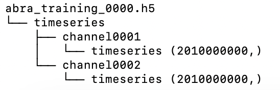
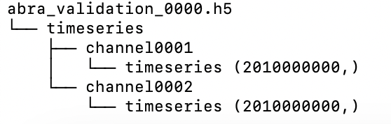
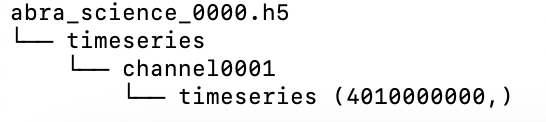
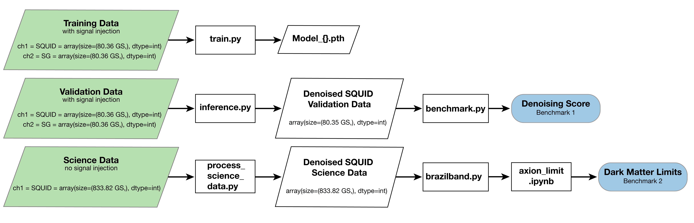

# TIDMAD
Code repository for TIDMAD: TIme series dataset for discovering Dark Matter with Ai Denoising. __TL;DR:__  TIDMAD is the first dataset and benchmark from a dark matter physics experiment, providing ultra-long time series data and comprehensive tools that enable machine learning models to directly advance the fundamental physics search for dark matter.

[Paper Pre-Print](https://arxiv.org/abs/2406.04378)

## Download Data
The TIDMAD dataset can be downloaded using the `download_data.py` script provided in this GitHub repository. This script runs without any external dependencies. Data downloading is achieved by generating a series of wget commands and executing them in a Linux environment. `download_data.py` has the following arguments:
* `--output_dir -o`: Destination directory where the file will be downloaded, default: current working directory.
* `--cache -c` Which OSDF cache location should be used to download data. Options includes [NY/NorCal/SoCal/Director(default)]:
  * NY: New York
  * NorCal: Sunnyvale
  * SoCal: San Diego
  * Director: automatically find the fastest cache location based on user's location.
     * **WARNING:** Director cache is sometimes unstable. We recommend switching to a different cache if the download fails.
* `--train_files -t`: Number of training files to download, must be an integer between 0 and 20, default 20.
* `--validation_files -v`: Number of validation files to download, must be an integer between 0 and 20, default 20.
* `--science_files -s`: Number of science files to download, must be an integer between 0 and 208, default 208.
* `-f, --force`: Directly proceed to download without showing the file size and asking the confirmation question.
* `-sk, --skip_downloaded`: Skip the file that has already exist at --output_dir
* `-w, --weak`: Download the weak signal version of training and validation files. In this version, the injected signal is 1/5 the amplitude of the normal version. This is a more challenging denoising task. Note that the normal version has a file range 0000-0019, while the weak version has a file range of 0020-0039.
* `-p, --print`: Print out all wget commands instead of actually executing the download commands.

Alternatively, you can use the `filelist.dat` file, which contains the wget commands to download the entire dataset (except the weak signal version).

## Dataset Composition:
The dataset includes 248 files (288 if the weak signal version is included), all in HDF5 format. Dataset composition is specified in `TIDMAD_croissant.json`. The dataset is partitioned into three subsets:
1. Training Dataset: `abra_training_00{##}.h5` where ## varies from 00 to 19
   * Each training `.h5` file has the following format: 
2. Training Dataset: `abra_validation_00{##}.h5` where ## varies from 00 to 19
   * Each validation `.h5` file has the following format: 
2. Science Dataset: `abra_science_0{###}.h5` where ### varies from 000 to 207
   * Each science `.h5` file has the following format: 
   * For science files, there are no injected fake signal therefore only 1 channel is present

**Caveat:** Due to a hardware condition, the size of channel0001 and channel0002 time series in a few training and validation files are not identical. This does not affect the sample-to-sample correspondence between the two channels except in the last few time samples. To get around this, we recommend only using the first 2,000,000,000 samples in both channels for all files (i.e. `ch01_time_series = ch01_time_series[:2000000000]`).

## Model Training and Benchmarking:
 
 
TIDMAD users could follow the procedure below to reprocued the result in our paper:
1. Run `python download_data.py` script to download all datasets
2. Set up the required environment using `python setup.py install`
3. Train 3 deep learning models by running `python train.py -d [directory] -m [model]`
   * `[directory]` is where all the training files are downloaded to in step 1
   * `[model]` is the deep learning model to train, user should choose from `[fcnet/punet/transformer]`.
   * Note: for each deep learning model, 4 files will be produced due to Frequency Splitting discussed in the paper. (i.e. for `-m fcnet` there will be 4 files including `FCNet_0_4.pth`, `FCNet_4_10.pth`, `FCNet_10_15.pth`, `FCNet_15_20.pth`
4. Run `python inference.py -d [directory] -m [model]` to produced denoised time series file in `.h5` format
   * `[directory]` is where all the validation files are downloaded to in step 1.
   * For each validation file `abra_validation_00{##}.h5`, a denoised validation file `abra_validation_denoised_[model]_00{##}.h5` will be generated. Please note that the denoised validation file will also be saved at `[directory]`.
   * `[model]` is the denoising algorithm to run inference over, user should choose from `[mavg/savgol/fcnet/punet/transformer]`. If user choose one of `[fcnet/punet/transformer]`, the trained model file in `.pth` format must be present at current working directory. These `.pth` file can be generated following step 3 or downloaded directly.
5. Run `python benchmark.py -d [directory] -m [model]`
   * `[directory]` is where all the validation files are downloaded to in step 1.
   * `[model]` is the denoising algorithm used in step 4, user should choose from `[none/mavg/savgol/fcnet/punet/transformer]`. `none` calculates the denoising score for raw SQUID time series without any denoising. If any model other than `none` is chosen, user must make sure that the corresponding `abra_validation_denoised_[model]_00{##}.h5` was successfully produced in step 4.
   * `python benchmark.py` has additional arguments, including:
       * `-c --coarse`: calculate coarse denoising score instead of fine denoising score
       * `-p --parallel`: parallelize the runing of the score calculation script
       * `-w, --num_workers`: maximum number of workers allowed for the parallel processing 
6. Run `python process_science_data.py -d [directory] -m [model]` to generate the denoised time series over the 208 science files provided.
   * `[directory]` is the directory of the input files. The file names should match the downloaded, raw science data files. Do not edit science file names.
   * `[model]` is one of the three deep learning models developed: `punet`, `fcnet`, or `transformer`
   * **Note** the corresponding `.pth` files must be in the same directory as the `process_science_data.py` program.
   * The denoised science data will be outputed with the following file names:
       * `denoised_[PUNet/FCNet/Transformer]_[0/4/10/15]_[4/10/15/20]ph_file_[0000-0207].h5`
7. Run `python brazilband.py [path] [files] [output file name (no extention)] --level coarse --v` to generate dark matter limit in `[outpt].csv` and brazil band plot in `[output].png`.
    * `brazilband.py` has arguments including:
       *   `[path]` is the pathway to all of the input files listed in the `txt` file.
       *   `[files]` is either the `.txt` file containing all of the `.h5` file names. Or, if psd averaging has been done, the `.npy` file containing `[freq, pwr]`.
       *   `[out]` is the file name for output brazil band plot. Plot will be saved as `[out].png`. Data will be saved at `[out].csv`. If input file type is `.txt` the average psd will be saved in `[out].npy`.
       *   `--level` is either 'coarse' or 'fine' for coarse or full axion mass points. Standard is 'coarse'.
       *   `--v` for verbose option for logger and error messages.
8. Run `AxionPhoton_TIDMAD.ipynb` to produce the global Dark Matter Limit plot. This Jupyter notebook utilizes the plotting tools from [AxionLimits](https://github.com/cajohare/AxionLimits) along with a specific plotting function `PlotFuncs_TIDMAD.py` for this project.
   * **Note**: the denoised `.csv` files generated by step 7 must placed in the `limit_data` folder. The variable `denoised_ABRA_limit_file` in the jupyter notebook must be changed accordingly.
   * You must have `AxionPhoton_TIDMAD.ipynb`, `PlotFuncs_TIDMAD.py`, and `limit_data` (along with all of its contents) in the same directory for this script to run.

## Paper Abstract
Dark matter makes up approximately 85\% of total matter in our universe, yet it has never been directly observed in any laboratory on Earth as of today. The origin of dark matter is one of the most important questions in contemporary physics, and a convincing detection of dark matter would be a Nobel-Prize-level breakthrough in fundamental science. The ABRACADABRA experiment was meticulously designed to search for dark matter. Although it has not yet made a discovery, ABRACADABRA has produced several dark matter search result widely endorsed by the physics community. The experiment generates ultra-long time-series data at a rate of 10 million samples per second, where the dark matter signal, if exist, would manifest  itself as a sinusoidal oscillation mode within the ultra-long time series. In this paper, we present a comprehensive data release from the ABRACADABRA experiment including three key components: a ultra-long time series dataset divided into training, validation, and dark matter search subsets; a carefully-designed denoising score for direct model benchmarking; and a complete analysis framework which yield a community-standard dark matter search result suitable for publication in a physics journal. Our data release enables core AI algorithms to directly produce physics results thereby advancing fundamental science.

## License
Both the TIDMAD dataset and the associated software in this repository are licensed under the [CC BY 4.0](https://creativecommons.org/licenses/by/4.0/) license
